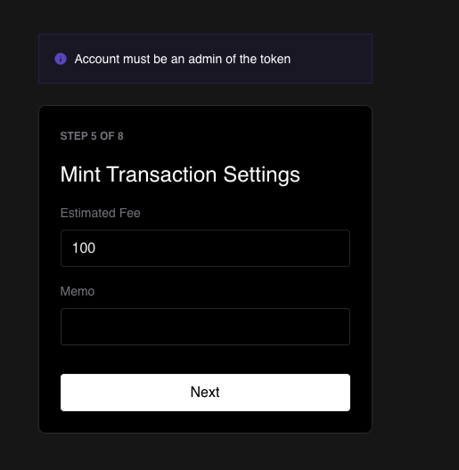

# Soroban React Mint Token

This serves as a basic example of how a token administrator can mint more tokens
on Soroban.

## Prerequisites

The Mint Token DApp relies on the following dependencies:

- Node (>=16.14.0 <17.0.0): https://nodejs.org/en/download/

- Yarn (v1.22.5 or newer): https://classic.yarnpkg.com/en/docs/install

- Freighter wallet: https://www.freighter.app/

## Features

The Mint Token DApp offers the following features:

1. **Freighter Wallet Integration**: The Mint Token DApp seamlessly integrates
   with Freighter, allowing users to connect their Freighter wallet to access
   Soroban token balances and utilize the signing capabilities of Freighter for
   secure and integrity-checked transactions.

2. **Transaction Construction**: Leveraging the Soroban token's contract
   interface, the DApp constructs transactions that invoke the `mint`
   method. This method facilitates the minting of new tokens to an address.

## Getting Started

To use the Payment DApp, follow these steps:

1. Install and set up the [Freighter wallet](https://www.freighter.app/).

2. Clone and navigate into the
   [Payment DApp repository](https://github.com/stellar/soroban-react-payment/tree/main)
   by trunning the following:

   ```
   git clone https://github.com/stellar/soroban-react-payment.git
   cd soroban-react-payment
   ```

3. Install the dependencies by running the following:

   ```
   yarn
   ```

4. Connect your Freighter wallet to the DApp and ensure that experimental mode
   is enabled. You can find this setting in Freighter wallet at:
   _`Settings(⚙️)>Preferences>ENABLE EXPERIMENTAL MODE`_.


6. [Enable and add Soroban Tokens](https://soroban.stellar.org/docs/getting-started/connect-freighter-wallet#enable-soroban-tokens)
   in Freighter.

7. Connect the dapp to Freighter.


8. Add the public key for the account that will receive the newly minted tokens.


9. Add the contract ID for the token that you will be minting, and add the quantity of new tokens to mint.


<br/>


10. Set the desired transaction fee & memo.



11. Confirm your transaction parameters, and submit it to the network.


<br/>


12. View your transaction's result XDR and optionally start the mint flow over.


## Build the Project

```
yarn && yarn build
```

## Starting a Dev Environment

```
yarn && yarn start
```

## Contributions

Contributions to the Payment DApp are welcome. If you encounter any issues, have
suggestions for improvements, or would like to contribute to the codebase,
please submit an issue, pull request, or reach out to us on
[Discord](https://discord.com/channels/897514728459468821/1037073682599780494).